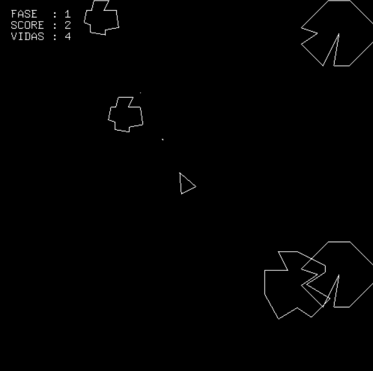

# Asteroids

Implementação do jogo clássico de arcade Asteroids como projeto da disciplina de Computação Gráfica do curso de bacharelado em Ciência da Computação da UFRN em 2008.

## Controle

Tecla                       | Ação
--------------------------- | ---------------------------------
UP                          | Aciona o jato propulsor.
LEFT                        | Gira a espaçonave para a esquerda.
RIGHT                       | Gira a espaçonave para a direita.
'A', 'a' ou SPACE           | Dispara projéteis phaser.
'H' ou 'h'                  | Salta para o hiper-espaço.
'P' ou 'p'                  | Pausa o jogo.
'Q', 'q' ou ESC             | Finaliza o jogo.
'R' ou 'r'                  | Reseta o jogo.

## Pontuação

Inimigo              | Pontos
-------------------- | ------
Asteróide grande     | 2 
Asteróide médio      | 5 
Asteróide pequeno    | 10 
Disco voador grande  | 15 
Disco voador pequeno | 30 

## Limitações

1. O máximo de disparos phaser que podem ser exibidos simultaneamente na tela (somando os disparos da nave e dos discos voadores) é 50.

2. Se ocorrerem muitas explosões simultâneas, é provável que o jogo trave, pois há uma limitação quanto ao número de faíscas de explosão (máximo de 50 "faíscas", e cada explosão consome de 2 a 4 faíscas).

3. Quando a espaçonave explode, é iniciada uma contagem (tempo de espera) para ela renascer no centro da tela. Não foi feita detecção de colisão para saber se a nave renasce "em segurança" (isso quer dizer que ela pode renascer sobre um objeto e consequentemente explodir novamente).

4. O disco voador grande não realiza deslocamentos verticais.